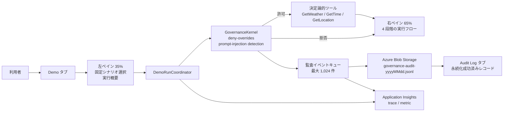

<div align="center">

# Agent Governance Toolkit デモ

安全な AI エージェントのツール実行、ポリシー判定、監査証跡を体験できるリファレンス実装

[](.github/workflows/build-test.yml)
[](https://dotnet.microsoft.com/download/dotnet/8.0)
[](https://dotnet.microsoft.com/apps/aspnet/web-apps/blazor)
[](https://azure.microsoft.com/products/container-apps/)
[](LICENSE)

**日本語** | [English](Readme-en.md)

[機能](#画面とアーキテクチャ) · [ローカル実行](#ローカル実行) · [Docker](#ビルドテストlinux-publishdocker) · [Azure への配置](#azure-リソースと-standard-container-apps-配置) · [セキュリティ](#セキュリティ上の選択)

</div>

固定された安全なツール呼び出しを `Microsoft.AgentGovernance` 4.0.0 で評価し、許可・拒否の判断過程と Azure Blob Storage に永続化された監査レコードをタブで切り替えて確認する .NET 8 Blazor Server デモです。

> [!IMPORTANT]
> このアプリは汎用エージェント、任意プロンプト実行環境、シェル、実 API クライアントではありません。デモ用に列挙した決定論的シナリオだけを扱います。

## 画面とアーキテクチャ



- **概要ページ (`/`)**: デモの目的と 4 段階のガバナンスフローを簡潔に説明し、専用デモページへ案内します。
- **Demo タブ左ペイン (35%)**: `/demo` で固定シナリオの選択、実行操作、現在の判断と出力の要約を表示します。
- **Demo タブ右ペイン (65%)**: Request、Governance Gate、Tool Execution、Result の 4 段階を進行に合わせて更新し、拒否時は未実行・ブロックを明示します。下部には選択シナリオへ適用するゲートと確認済みの C# 抜粋を常時表示し、実行後は評価行、deny 分岐、早期 return のどこを通過したかを強調します。
- **Audit Log タブ**: Blob Append が成功した現在のブラウザセッションの監査レコードを全幅表示します。タブを切り替えても実行状態、セッション、購読、監査レコードは保持されます。「Blob から再読込」は当日 UTC の JSONL を読み、現在のページで生成された監査セッション ID に一致する行を復元します。ページ再読み込み後は新しいセッション ID になります。
- ガバナンスイベントは容量 1,024 の単一 reader キューへ入り、最大 3 回の試行で日別 Append Blob に追記されます。同期コールバックをブロックしないため、満杯時は新しいイベントを拒否し、監査ストレージを失敗状態にします。

## 固定シナリオと安全境界

| シナリオ ID               | ツール          | 期待結果 | 実装上の動作                             |
| ------------------------- | --------------- | -------: | ---------------------------------------- |
| `weather-allowed`         | `GetWeather`    |     許可 | Seattle の固定天気文字列を返す           |
| `time-allowed`            | `GetTime`       |     許可 | 固定 UTC 時刻を返す                      |
| `location-allowed`        | `GetLocation`   |     許可 | 固定デモ位置を返す                       |
| `shell-explicitly-denied` | `execute_shell` |     拒否 | 明示 deny。シェル実装自体が存在しない    |
| `unknown-default-denied`  | `UnknownTool`   |     拒否 | `default_action: deny` により拒否        |
| `prompt-injection-denied` | `GetWeather`    |     拒否 | 固定された敵対文字列をツール実行前に検出 |

実行時は `src\AgentGovernanceDemo\policies\default.yaml` を読み込みます。このファイルはビルドおよび publish 出力へコピーされます。コード内にも同内容の既定ポリシーをフォールバックおよび説明 UI 用に保持しています。競合時は deny を優先します。許可された 3 ツールもネットワーク、OS、ファイル、Azure API を呼ばず、固定文字列だけを返します。

右ペインの C# 抜粋は publish 後にも表示できる説明用の固定データです。実際の Toolkit 判断結果とライブ実行状態に連動して強調され、重要行が実装から外れた場合はテストで検出します。

## 前提条件

- Windows PowerShell 7 以降を推奨
- [.NET 8 SDK](https://dotnet.microsoft.com/)（プロジェクトの runtime target は `net8.0`）
- コンテナー検証時は Docker Desktop または互換 Docker daemon
- Azure 配置時:
  - Azure CLI
  - `containerapp` 拡張機能 **1.3.0b4 以降**
  - Azure サブスクリプションへサインインできる Microsoft Entra アカウント
  - Entra アプリ、サービスプリンシパル、フェデレーション資格情報を作成できるディレクトリ権限
  - 対象リソースグループでロール割り当てを作成できる権限
  - Standard Azure Container Apps と Private Endpoint を利用できるリージョン

```powershell
az login
az extension add --name containerapp --upgrade --allow-preview true --only-show-errors
az extension show --name containerapp --query version --output tsv
```

## ローカル実行

Azure を接続せず UI とポリシー判定だけ確認できます。

```powershell
dotnet restore .\AgentGovernanceDemo.slnx --nologo
dotnet run --project .\src\AgentGovernanceDemo\AgentGovernanceDemo.csproj --launch-profile https
```

ブラウザーで `https://localhost:7011` を開くと概要ページ、`https://localhost:7011/demo` を開くとデモ画面を表示します。開発 HTTPS 証明書が未信頼の場合は、必要に応じて `dotnet dev-certs https --trust` を実行してください。

### Azure Blob と Application Insights を接続する

Development 環境では `DefaultAzureCredential` を使用します。対話ブラウザー資格情報は除外されるため、ローカルでは通常 `az login` 済みの Azure CLI 資格情報を使用します。Blob コンテナーに `Storage Blob Data Contributor` が必要です。

```powershell
$env:Storage__AccountUri = 'https://<storage-account>.blob.core.windows.net/'
$env:Storage__AuditContainerName = 'agt-audit'
$env:APPLICATIONINSIGHTS_CONNECTION_STRING = '<Application Insights connection string>'

dotnet run --project .\src\AgentGovernanceDemo\AgentGovernanceDemo.csproj --launch-profile https
```

値を設定しない場合、`appsettings.json` の Storage URI とコンテナー名が使われます。既定の `https://devstoreaccount1.blob.core.windows.net/` は未接続デモ用のプレースホルダーであり、Azurite を自動起動または構成するものではありません。この状態では UI とポリシー判定は動作しますが、Blob の読み書きは失敗状態になります。`APPLICATIONINSIGHTS_CONNECTION_STRING` は未設定ならテレメトリ無効、不正形式なら構成エラー表示になります。接続文字列、資格情報、トークンを README、ソース、ログへ貼り付けないでください。

### 構成リファレンス

| 環境変数                                | 必須条件                 | 用途                                                    |
| --------------------------------------- | ------------------------ | ------------------------------------------------------- |
| `Storage__AccountUri`                   | Azure 監査を使う場合     | HTTPS Blob service URI                                  |
| `Storage__AuditContainerName`           | Azure 監査を使う場合     | 小文字の Blob コンテナー名。既定 `agt-audit`            |
| `Storage__RecentRecordLimit`            | 任意                     | UI で復元・保持する監査レコード上限。既定 100、最大 500 |
| `Demo__MaxRunsPerMinute`                | 任意                     | ブラウザーセッション単位の実行上限。既定 8              |
| `Demo__StepDelayMilliseconds`           | 任意                     | 4 段階フロー間の表示遅延。既定 450 ms、最大 5,000 ms    |
| `AZURE_CLIENT_ID`                       | Standard ACA 配置時      | Runtime User-assigned Managed Identity の client ID     |
| `APPLICATIONINSIGHTS_CONNECTION_STRING` | Azure Monitor を使う場合 | Workspace-based Application Insights 接続文字列         |
| `ASPNETCORE_URLS`                       | コンテナー時             | 配置スクリプトは `http://+:8080` を設定                 |

## ビルド、テスト、Linux publish、Docker

```powershell
dotnet restore .\AgentGovernanceDemo.slnx --nologo
dotnet build .\AgentGovernanceDemo.slnx --configuration Release --no-restore --nologo
dotnet test .\AgentGovernanceDemo.slnx --configuration Release --no-build --nologo

dotnet publish .\src\AgentGovernanceDemo\AgentGovernanceDemo.csproj `
  --configuration Release `
  --runtime linux-x64 `
  --self-contained false `
  --output .\artifacts\publish-linux-x64 `
  /p:UseAppHost=false

docker build `
  --platform linux/amd64 `
  --provenance=false `
  --file .\src\AgentGovernanceDemo\Dockerfile `
  --tag agent-governance-demo:local `
  .

docker run --rm --name agent-governance-demo `
  --publish 8080:8080 `
  agent-governance-demo:local
```

Docker 実行時は `http://localhost:8080` を開きます。`--provenance=false` は、単一の Linux amd64 イメージとして扱えない OCI provenance index が Azure Container Apps へ渡ることを防ぎ、CI のコンテナービルド設定とも整合させます。Azure 構成を渡す場合は、シークレットをコマンド履歴へ直接記載せず `--env-file` 等のローカルな秘密管理手段を使用してください。

## Azure リソースと Standard Container Apps 配置

### 1. Entra アプリと GitHub OIDC を準備する

`scripts\bootstrap-service-principal.ps1` は次を作成または再利用します。

- GitHub Actions 配置用 Entra application/service principal
- GitHub Actions が発行する subject と一致する OIDC federated credential
- 対象リソースグループの `Contributor` と `Role Based Access Control Administrator`

```powershell
.\scripts\bootstrap-service-principal.ps1 `
  -SubscriptionId '<subscription-id>' `
  -ResourceGroupName 'rg-agent-governance-demo' `
  -Location 'eastasia' `
  -GitHubOrganization '<organization>' `
  -GitHubRepository '<repository>' `
  -GitHubEnvironment 'production'
```

通常の subject は `repo:<organization>/<repository>:environment:production` です。GitHub Actions のログに
`repo:<organization>@<organization-id>/<repository>@<repository-id>:environment:production` のような
数値 ID 付き subject が表示される場合は、その値を `-GitHubSubject '<subject claim>'` で指定して再実行します。
既存の federated credential は同じ名前で更新されます。

Runtime identity は Bicep が User-assigned Managed Identity として作成します。アプリ用 client secret は不要です。

### 2. Bicep で依存リソースを作成する

`infra\main.bicep` は Storage、private Blob container、Basic ACR、Log Analytics、workspace-based Application Insights に加え、VNet、Standard Container Apps environment、Blob Private Endpoint、Private DNS、Runtime Managed Identity を作成します。Managed Identity にはコンテナー単位の `Storage Blob Data Contributor` と ACR 単位の `AcrPull` を付与します。Storage の public network access、shared key、Blob public access は無効です。

```powershell
az group create `
  --name 'rg-agent-governance-demo' `
  --location 'eastasia' `
  --only-show-errors `
  --output none

az deployment group create `
  --name 'agent-governance-infra' `
  --resource-group 'rg-agent-governance-demo' `
  --template-file .\infra\main.bicep `
  --parameters `
    location='eastasia' `
    environmentName='demo' `
    containerRegistryName='<globally-unique-acr-name>' `
    auditContainerName='agt-audit' `
  --only-show-errors `
  --output none

$outputs = az deployment group show `
  --name 'agent-governance-infra' `
  --resource-group 'rg-agent-governance-demo' `
  --query properties.outputs `
  --output json | ConvertFrom-Json
```

`infra\main.parameters.json` も同じパラメーターを示します。プレースホルダーを実値に置き換えないまま配置しないでください。

### 3. イメージを ACR でビルドする

```powershell
az acr build `
  --registry '<globally-unique-acr-name>' `
  --image 'agent-governance-demo:manual' `
  --platform linux/amd64 `
  --file .\src\AgentGovernanceDemo\Dockerfile `
  . `
  --only-show-errors
```

### 4. Standard Container App を配置する

Preflight は Standard environment の VNet integration、Consumption workload profile、必要な CLI フラグを確認します。

```powershell
.\scripts\deploy-standard.ps1 `
  -ResourceGroupName 'rg-agent-governance-demo' `
  -EnvironmentName $outputs.containerAppsEnvironmentName.value `
  -ContainerAppName 'ca-agent-governance-standard' `
  -ContainerRegistryName '<globally-unique-acr-name>' `
  -Image '<globally-unique-acr-name>.azurecr.io/agent-governance-demo:manual' `
  -RuntimeIdentityResourceId $outputs.runtimeIdentityResourceId.value `
  -RuntimeIdentityClientId $outputs.runtimeIdentityClientId.value `
  -StorageAccountUri $outputs.storageAccountUri.value `
  -AuditContainerName $outputs.auditContainerName.value `
  -ApplicationInsightsConnectionString $outputs.applicationInsightsConnectionString.value `
  -PreflightOnly
```

実配置時は `-PreflightOnly` を外します。Runtime secret は使用しません。

```powershell
.\scripts\deploy-standard.ps1 `
  -ResourceGroupName 'rg-agent-governance-demo' `
  -EnvironmentName $outputs.containerAppsEnvironmentName.value `
  -ContainerAppName 'ca-agent-governance-standard' `
  -ContainerRegistryName '<globally-unique-acr-name>' `
  -Image '<globally-unique-acr-name>.azurecr.io/agent-governance-demo:manual' `
  -RuntimeIdentityResourceId $outputs.runtimeIdentityResourceId.value `
  -RuntimeIdentityClientId $outputs.runtimeIdentityClientId.value `
  -StorageAccountUri $outputs.storageAccountUri.value `
  -AuditContainerName $outputs.auditContainerName.value `
  -ApplicationInsightsConnectionString $outputs.applicationInsightsConnectionString.value
```

スクリプトは外部 ingress/port 8080、Consumption workload profile、min 0/max 1 replica、Managed Identity による ACR pull、環境変数を設定し、配置後に実状態を検証します。

## GitHub Actions OIDC

`.github\workflows\deploy.yml` は `main` push または手動実行で、production environment を使って OIDC ログインし、テスト、Private Endpoint を含む Bicep、ACR build、Standard ACA 配置を行います。

GitHub environment **`production`** に次を登録します。

**Environment variable**

- `AZURE_ACR_NAME`: globally unique ACR resource name

**Environment secrets**

- `AZURE_CLIENT_ID`: GitHub 配置用 application client ID
- `AZURE_TENANT_ID`
- `AZURE_SUBSCRIPTION_ID`

workflow 内の固定値は `RESOURCE_GROUP=rg-agent-governance-demo`、`LOCATION=eastasia`、`CONTAINER_APP_NAME=ca-agent-governance-standard`、`IMAGE_REPOSITORY=agent-governance-demo` です。変更する場合は workflow と OIDC environment subject を整合させてください。

## 監査とテレメトリを確認する

### Blob JSONL

Blob 名はイベント timestamp の UTC 日付を使う `governance-audit-yyyyMMdd.jsonl`、content type は `application/x-ndjson` です。Storage の public network access は無効なので、Blob の直接取得は VNet 接続済み端末から実行します。通常の確認にはアプリの `Audit Log` タブを使用します。

```powershell
$date = (Get-Date).ToUniversalTime().ToString('yyyyMMdd')
$blobName = "governance-audit-$date.jsonl"
$downloadPath = ".\artifacts\$blobName"

az storage blob download `
  --account-name $outputs.storageAccountName.value `
  --container-name $outputs.auditContainerName.value `
  --name $blobName `
  --file $downloadPath `
  --auth-mode login `
  --only-show-errors

Get-Content -LiteralPath $downloadPath |
  ForEach-Object { $_ | ConvertFrom-Json } |
  Format-Table Timestamp, Type, AgentId, SessionId, PolicyName
```

監査 sanitizer は password、secret、token、API key、connection string、SAS、JWT、Bearer token、URI 埋め込み資格情報、メールアドレス等をマスクします。シリアライズ不能なデータは fail closed で保存しません。

### Application Insights

Azure portal で Bicep 出力に対応する Application Insights の **Logs** を開き、例えば次を実行します。

```kusto
AppDependencies
| where TimeGenerated > ago(1h)
| where Name in ("demo.run", "governance.policy.evaluate", "audit.blob.append")
| project TimeGenerated, Name, Success, DurationMs, Properties
| order by TimeGenerated desc
```

```kusto
AppMetrics
| where TimeGenerated > ago(1h)
| where Name startswith "agent_governance_demo."
| project TimeGenerated, Name, Sum, Count, Properties
| order by TimeGenerated desc
```

実装済みメトリックは run、policy evaluation、Blob append の件数と所要時間です。connection string が未設定または不正でもアプリは起動し、UI 上で無効または構成エラーを表示します。

## Azure がない場合の縮退動作

- アプリ起動、左ペインのシナリオ選択、ポリシー判定、固定ツール実行は継続します。
- Blob 読み取りは失敗状態になり、`Audit Log` タブは空のままです。`Demo` タブの大型実行フローは継続して利用できます。
- 監査書き込みは 3 回再試行後に失敗として記録されますが、許可・拒否の判定結果自体は変えません。
- Application Insights がなければ OpenTelemetry exporter は登録されません。
- これはデモ可用性を優先した縮退です。監査永続化を必須とする本番システムでは、保存失敗時に処理を成功扱いしない設計へ変更してください。

## セキュリティ上の選択

- default deny、deny-overrides、prompt-injection detection
- 任意入力・任意ツール・シェル実行なし
- ブラウザーセッション単位の実行回数制限と、実行中の二重起動防止
- HTTPS-only Storage、TLS 1.2 以上、public network access 無効、Blob public access 無効、shared key 無効
- Blob Private Endpoint と Private DNS
- Runtime Managed Identity への Blob container scope と ACR scope の最小 RBAC
- 監査データの資格情報・個人情報パターンを保存前に redact
- CSP、`X-Frame-Options: DENY`、`nosniff`、`no-referrer`、HSTS（非 Development）
- コンテナーは非 root の `app` user、diagnostics 無効、Linux amd64 固定
- GitHub Actions は OIDC を使用し、checkout action 等を commit SHA で固定

ACR admin user は Bicep で無効化され、Standard app は User-assigned Managed Identity だけでイメージを pull します。

## Standard ACA と scale-to-zero

- Standard workload profiles environment を VNet に統合
- Storage Blob は Private Endpoint のみ
- Container App は外部 HTTPS ingress
- Consumption workload profile
- HTTP concurrency 20
- min 0 / max 1 replica
- 0 replica からの初回アクセスには cold start が発生
- Blazor Server の in-memory session は scale-to-zero、revision 更新、再起動で失われる
- 永続化済み監査ログは Blob に残る

## トラブルシューティング

### Docker daemon に接続できない

```powershell
docker version
docker info
```

`error during connect`、named pipe エラー等の場合は Docker Desktop を起動し、Linux containers モードと daemon の稼働を確認してから再実行します。

### `containerapp` の Managed Identity フラグが未対応

```powershell
az extension add --name containerapp --upgrade --allow-preview true --only-show-errors
az extension show --name containerapp --query version --output tsv
az containerapp create --help
az containerapp registry set --help
```

`--user-assigned`、`--registry-identity`、`--scale-rule-http-concurrency` が利用できない場合は拡張機能を更新し、`deploy-standard.ps1 -PreflightOnly` が成功するまで配置しないでください。

### Blob が 403 になる

- `Storage__AccountUri` が Blob service URI か確認します。
- `AZURE_CLIENT_ID` が Runtime User-assigned Managed Identity client ID か確認します。
- ロール伝播を待ち、コンテナー scope の `Storage Blob Data Contributor` を確認します。
- Container Apps environment の VNet integration、Blob Private Endpoint、`privatelink.blob.core.windows.net` の VNet link を確認します。
- Storage の public network access は Disabled のままにします。
- shared key は無効なので connection string や account key 認証へ切り替えないでください。

### UI は動くが Audit Log タブが空

保存前イベントではなく、Blob Append 成功後のレコードだけを表示します。`Audit Log` タブの Storage 状態、Container Apps の環境変数、当日 UTC の Blob、現在のページの監査セッション ID を確認してください。

## 配置後の確認

1. `bootstrap-service-principal.ps1` を実 tenant/subscription で実行し、OIDC subject と 2 つの RG ロールを確認する。
2. `infra\main.bicep` を配置し、Storage public network access/shared key/public Blob が無効、Private Endpoint、Private DNS、Managed Identity RBAC を確認する。
3. `deploy-standard.ps1 -PreflightOnly` を実行し、VNet-integrated Standard environment と Consumption workload profile を確認する。
4. ACR build 後に `deploy-standard.ps1` を実行し、外部 ingress 8080、min 0/max 1、Managed Identity ACR pull、全環境変数、FQDN 応答を確認する。
5. 6 シナリオを FQDN 上で実行し、許可 3 件だけ固定ツールが動き、拒否 3 件ではツールが一度も動かないことを確認する。
6. `governance-audit-yyyyMMdd.jsonl` の追記、JSONL 妥当性、session correlation、redaction、再読込を確認する。
7. Application Insights で 3 種の activity と run/policy/blob の metrics、失敗時 outcome を確認する。
8. GitHub `production` environment の OIDC workflow を手動実行し、Runtime client secret を使わず再配置できることを確認する。
9. Storage または Application Insights を一時的に到達不能にし、文書化した縮退表示、3 回再試行、資格情報非出力を確認する。
10. アイドル後に 0 replica へ縮退し、再アクセスで復帰することを確認する。
