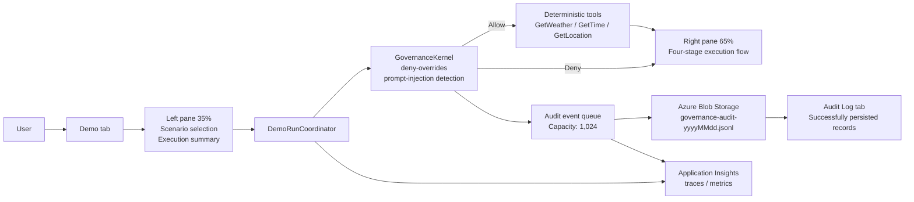

<div align="center">

# Agent Governance Toolkit Demo

A reference implementation for exploring safe AI agent tool execution, policy decisions, and audit trails

[](.github/workflows/build-test.yml)
[](https://dotnet.microsoft.com/download/dotnet/8.0)
[](https://dotnet.microsoft.com/apps/aspnet/web-apps/blazor)
[](https://azure.microsoft.com/products/container-apps/)
[](LICENSE)

[日本語](README.md) | **English**

[Features](#interface-and-architecture) · [Run locally](#run-locally) · [Docker](#build-test-linux-publish-and-docker) · [Deploy to Azure](#azure-resources-and-standard-container-apps-deployment) · [Security](#security-decisions)

</div>

This .NET 8 Blazor Server demo evaluates predefined safe tool calls with `Microsoft.AgentGovernance` 4.0.0. It shows the allow/deny decision process and audit records persisted to Azure Blob Storage in separate tabs.

> [!IMPORTANT]
> This application is not a general-purpose agent, arbitrary prompt execution environment, shell, or live API client. It handles only the deterministic scenarios enumerated for the demo.

## Interface and architecture



- **Demo tab, left pane (35%)**: Select a predefined scenario, run it, and inspect the current decision and output summary.
- **Demo tab, right pane (65%)**: Follow Request, Governance Gate, Tool Execution, and Result as the run progresses. Denied requests clearly show that execution was blocked.
- **Audit Log tab**: Shows audit records successfully appended to Blob Storage during the current browser session. Switching tabs preserves run state, session state, subscriptions, and records. **Reload from Blob** reads the current UTC day's JSONL file and restores rows matching the audit session ID generated by the current page. Reloading the page creates a new session ID.
- Governance events enter a single-reader queue with a capacity of 1,024 and are appended to a daily Append Blob with up to three attempts.

## Deterministic scenarios and safety boundary

| Scenario ID               | Tool            | Expected | Behavior                                                 |
| ------------------------- | --------------- | -------: | -------------------------------------------------------- |
| `weather-allowed`         | `GetWeather`    |    Allow | Returns a fixed Seattle weather string                   |
| `time-allowed`            | `GetTime`       |    Allow | Returns a fixed UTC time                                 |
| `location-allowed`        | `GetLocation`   |    Allow | Returns a fixed demo location                            |
| `shell-explicitly-denied` | `execute_shell` |     Deny | Explicitly denied; no shell implementation exists        |
| `unknown-default-denied`  | `UnknownTool`   |     Deny | Denied by `default_action: deny`                         |
| `prompt-injection-denied` | `GetWeather`    |     Deny | Detects a fixed adversarial string before tool execution |

The policy is kept in `src/AgentGovernanceDemo/policies/default.yaml` in a verifiable form. The current runtime loads equivalent embedded YAML. Deny takes precedence when rules conflict. Even the three allowed tools never call the network, operating system, file system, or Azure APIs; they return fixed strings only.

## Prerequisites

- PowerShell 7 or later is recommended on Windows
- [.NET 8 SDK](https://dotnet.microsoft.com/) — the project targets `net8.0`
- Docker Desktop or a compatible Docker daemon for container testing
- For Azure deployment:
  - Azure CLI
  - `containerapp` extension **1.3.0b4 or later**
  - A Microsoft Entra account that can sign in to the Azure subscription
  - Directory permissions to create an Entra application, service principal, and federated credential
  - Permission to create role assignments in the target resource group
  - A region supporting Standard Azure Container Apps and Private Endpoint

```powershell
az login
az extension add --name containerapp --upgrade --allow-preview true --only-show-errors
az extension show --name containerapp --query version --output tsv
```

## Run locally

You can explore the UI and policy decisions without connecting to Azure.

```powershell
dotnet restore .\AgentGovernanceDemo.slnx --nologo
dotnet run --project .\src\AgentGovernanceDemo\AgentGovernanceDemo.csproj --launch-profile https
```

Open `https://localhost:7011`. If the development HTTPS certificate is not trusted, run `dotnet dev-certs https --trust` as needed.

### Connect Azure Blob Storage and Application Insights

The Development environment uses `DefaultAzureCredential`. Interactive browser credentials are excluded, so local development normally uses credentials established by `az login`. The identity needs `Storage Blob Data Contributor` on the Blob container.

```powershell
$env:Storage__AccountUri = 'https://<storage-account>.blob.core.windows.net/'
$env:Storage__AuditContainerName = 'agt-audit'
$env:APPLICATIONINSIGHTS_CONNECTION_STRING = '<Application Insights connection string>'

dotnet run --project .\src\AgentGovernanceDemo\AgentGovernanceDemo.csproj --launch-profile https
```

When values are omitted, the Storage URI and container name in `appsettings.json` are used. Telemetry is disabled when `APPLICATIONINSIGHTS_CONNECTION_STRING` is absent, and the UI reports a configuration error when it is malformed. Never put connection strings, credentials, or tokens in the README, source code, or logs.

### Configuration reference

| Environment variable                    | Required when             | Purpose                                                 |
| --------------------------------------- | ------------------------- | ------------------------------------------------------- |
| `Storage__AccountUri`                   | Using Azure audit storage | HTTPS Blob service URI                                  |
| `Storage__AuditContainerName`           | Using Azure audit storage | Lowercase Blob container name; default: `agt-audit`     |
| `Demo__MaxRunsPerMinute`                | Optional                  | Per-browser-session run limit; default: 8               |
| `AZURE_CLIENT_ID`                       | Deploying to Standard ACA | Client ID of the runtime user-assigned managed identity |
| `APPLICATIONINSIGHTS_CONNECTION_STRING` | Using Azure Monitor       | Workspace-based Application Insights connection string  |
| `ASPNETCORE_URLS`                       | Running the container     | Deployment script sets `http://+:8080`                  |

## Build, test, Linux publish, and Docker

```powershell
dotnet restore .\AgentGovernanceDemo.slnx --nologo
dotnet build .\AgentGovernanceDemo.slnx --configuration Release --no-restore --nologo
dotnet test .\AgentGovernanceDemo.slnx --configuration Release --no-build --nologo

dotnet publish .\src\AgentGovernanceDemo\AgentGovernanceDemo.csproj `
  --configuration Release `
  --runtime linux-x64 `
  --self-contained false `
  --output .\artifacts\publish-linux-x64 `
  /p:UseAppHost=false

docker build `
  --platform linux/amd64 `
  --file .\src\AgentGovernanceDemo\Dockerfile `
  --tag agent-governance-demo:local `
  .

docker run --rm --name agent-governance-demo `
  --publish 8080:8080 `
  agent-governance-demo:local
```

Open `http://localhost:8080` when running with Docker. To pass Azure configuration, use a local secret-management mechanism such as `--env-file` rather than putting secrets directly in shell history.

## Azure resources and Standard Container Apps deployment

### 1. Prepare the Entra application and GitHub OIDC

`scripts/bootstrap-service-principal.ps1` creates or reuses:

- An Entra application and service principal for GitHub Actions deployment
- An OIDC federated credential with subject `repo:<organization>/<repository>:environment:production`
- `Contributor` and `Role Based Access Control Administrator` on the target resource group

```powershell
.\scripts\bootstrap-service-principal.ps1 `
  -SubscriptionId '<subscription-id>' `
  -ResourceGroupName 'rg-agent-governance-demo' `
  -Location 'eastasia' `
  -GitHubOrganization '<organization>' `
  -GitHubRepository '<repository>' `
  -GitHubEnvironment 'production'
```

Bicep creates the runtime identity as a user-assigned managed identity. The application does not need a client secret.

### 2. Create dependencies with Bicep

`infra/main.bicep` creates Storage, a private Blob container, Basic ACR, Log Analytics, workspace-based Application Insights, a VNet, a Standard Container Apps environment, a Blob Private Endpoint, Private DNS, and the runtime managed identity. It assigns `Storage Blob Data Contributor` at container scope and `AcrPull` at registry scope. Storage public network access, shared key access, and public Blob access are disabled.

```powershell
az group create `
  --name 'rg-agent-governance-demo' `
  --location 'eastasia' `
  --only-show-errors `
  --output none

az deployment group create `
  --name 'agent-governance-infra' `
  --resource-group 'rg-agent-governance-demo' `
  --template-file .\infra\main.bicep `
  --parameters `
    location='eastasia' `
    environmentName='demo' `
    containerRegistryName='<globally-unique-acr-name>' `
    auditContainerName='agt-audit' `
  --only-show-errors `
  --output none

$outputs = az deployment group show `
  --name 'agent-governance-infra' `
  --resource-group 'rg-agent-governance-demo' `
  --query properties.outputs `
  --output json | ConvertFrom-Json
```

`infra/main.parameters.json` documents the same parameters. Do not deploy it without replacing its placeholders.

### 3. Build the image in ACR

```powershell
az acr build `
  --registry '<globally-unique-acr-name>' `
  --image 'agent-governance-demo:manual' `
  --platform linux/amd64 `
  --file .\src\AgentGovernanceDemo\Dockerfile `
  . `
  --only-show-errors
```

### 4. Deploy the Standard Container App

The preflight checks the Standard environment's VNet integration, Consumption workload profile, and required CLI flags.

```powershell
.\scripts\deploy-standard.ps1 `
  -ResourceGroupName 'rg-agent-governance-demo' `
  -EnvironmentName $outputs.containerAppsEnvironmentName.value `
  -ContainerAppName 'ca-agent-governance-standard' `
  -ContainerRegistryName '<globally-unique-acr-name>' `
  -Image '<globally-unique-acr-name>.azurecr.io/agent-governance-demo:manual' `
  -RuntimeIdentityResourceId $outputs.runtimeIdentityResourceId.value `
  -RuntimeIdentityClientId $outputs.runtimeIdentityClientId.value `
  -StorageAccountUri $outputs.storageAccountUri.value `
  -AuditContainerName $outputs.auditContainerName.value `
  -ApplicationInsightsConnectionString $outputs.applicationInsightsConnectionString.value `
  -PreflightOnly
```

Remove `-PreflightOnly` for the actual deployment. No runtime secret is used.

```powershell
.\scripts\deploy-standard.ps1 `
  -ResourceGroupName 'rg-agent-governance-demo' `
  -EnvironmentName $outputs.containerAppsEnvironmentName.value `
  -ContainerAppName 'ca-agent-governance-standard' `
  -ContainerRegistryName '<globally-unique-acr-name>' `
  -Image '<globally-unique-acr-name>.azurecr.io/agent-governance-demo:manual' `
  -RuntimeIdentityResourceId $outputs.runtimeIdentityResourceId.value `
  -RuntimeIdentityClientId $outputs.runtimeIdentityClientId.value `
  -StorageAccountUri $outputs.storageAccountUri.value `
  -AuditContainerName $outputs.auditContainerName.value `
  -ApplicationInsightsConnectionString $outputs.applicationInsightsConnectionString.value
```

The script configures external ingress on port 8080, the Consumption workload profile, min 0/max 1 replicas, managed-identity ACR pull, and application environment variables. It verifies the deployed state afterward.

## GitHub Actions OIDC

`.github/workflows/deploy.yml` runs on pushes to `main` or manually. It uses the `production` environment for OIDC login, tests the application, deploys Bicep including the Private Endpoint, builds in ACR, and deploys the Standard Container App.

Configure these values in the GitHub **`production`** environment.

**Environment variable**

- `AZURE_ACR_NAME`: Globally unique ACR resource name

**Environment secrets**

- `AZURE_CLIENT_ID`: Application client ID used for GitHub deployment
- `AZURE_TENANT_ID`
- `AZURE_SUBSCRIPTION_ID`

The workflow defaults are `RESOURCE_GROUP=rg-agent-governance-demo`, `LOCATION=eastasia`, `CONTAINER_APP_NAME=ca-agent-governance-standard`, and `IMAGE_REPOSITORY=agent-governance-demo`. If you change them, keep the workflow and OIDC environment subject aligned.

## Inspect audit data and telemetry

### Blob JSONL

The Blob name is derived from the event timestamp in UTC as `governance-audit-yyyyMMdd.jsonl`, with content type `application/x-ndjson`. Because Storage public network access is disabled, direct Blob downloads must run from a VNet-connected machine. For routine inspection, use the application's **Audit Log** tab.

```powershell
$date = (Get-Date).ToUniversalTime().ToString('yyyyMMdd')
$blobName = "governance-audit-$date.jsonl"
$downloadPath = ".\artifacts\$blobName"

az storage blob download `
  --account-name $outputs.storageAccountName.value `
  --container-name $outputs.auditContainerName.value `
  --name $blobName `
  --file $downloadPath `
  --auth-mode login `
  --only-show-errors

Get-Content -LiteralPath $downloadPath |
  ForEach-Object { $_ | ConvertFrom-Json } |
  Format-Table Timestamp, Type, AgentId, SessionId, PolicyName
```

The audit sanitizer masks passwords, secrets, tokens, API keys, connection strings, SAS values, JWTs, bearer tokens, credentials embedded in URIs, email addresses, and related patterns. Data that cannot be serialized fails closed and is not persisted.

### Application Insights

Open **Logs** for the Application Insights resource emitted by the Bicep deployment and run queries such as:

```kusto
AppDependencies
| where TimeGenerated > ago(1h)
| where Name in ("demo.run", "governance.policy.evaluate", "audit.blob.append")
| project TimeGenerated, Name, Success, DurationMs, Properties
| order by TimeGenerated desc
```

```kusto
AppMetrics
| where TimeGenerated > ago(1h)
| where Name startswith "agent_governance_demo."
| project TimeGenerated, Name, Sum, Count, Properties
| order by TimeGenerated desc
```

The application emits counts and duration metrics for runs, policy evaluation, and Blob appends. It still starts when the connection string is missing or malformed, and reports telemetry as disabled or misconfigured in the UI.

## Behavior without Azure

- Application startup, scenario selection, policy evaluation, and deterministic tool execution continue to work.
- Blob reads report a failure state and the **Audit Log** tab remains empty. The main execution flow on the **Demo** tab remains available.
- Audit writes are marked failed after three attempts, but do not change the policy decision.
- The OpenTelemetry exporter is not registered without Application Insights.
- This degradation favors demo availability. Production systems that require durable auditing should not treat an operation as successful when audit persistence fails.

## Security decisions

- Default deny, deny-overrides, and prompt-injection detection
- No arbitrary input, arbitrary tools, or shell execution
- Per-browser-session rate limiting and duplicate-run prevention
- HTTPS-only Storage, TLS 1.2 or later, public network access disabled, public Blob access disabled, shared key disabled
- Blob Private Endpoint and Private DNS
- Least-privilege RBAC for the runtime managed identity at Blob container and ACR scopes
- Credential and personal-information patterns redacted before audit persistence
- CSP, `X-Frame-Options: DENY`, `nosniff`, `no-referrer`, and HSTS outside Development
- Non-root `app` container user, diagnostics disabled, Linux amd64 target
- GitHub Actions uses OIDC and pins actions such as checkout to commit SHAs

The legacy Express app/environment was retired after migration to Standard. The ACR admin user is disabled, and the Standard app pulls images only through managed identity. The legacy runtime Entra application is not deleted automatically.

## Standard ACA and scale-to-zero

- Standard workload profiles environment integrated with a VNet
- Storage Blob accessible only through Private Endpoint
- External HTTPS ingress for the Container App
- Consumption workload profile
- HTTP concurrency: 20
- Min 0 / max 1 replicas
- The first request from zero replicas incurs a cold start
- In-memory Blazor Server sessions are lost on scale-to-zero, revision updates, or restarts
- Persisted audit logs remain in Blob Storage

## Troubleshooting

### Cannot connect to the Docker daemon

```powershell
docker version
docker info
```

For `error during connect`, named-pipe errors, or similar failures, start Docker Desktop, confirm Linux containers mode and daemon health, then retry.

### The `containerapp` extension does not support managed-identity flags

```powershell
az extension add --name containerapp --upgrade --allow-preview true --only-show-errors
az extension show --name containerapp --query version --output tsv
az containerapp create --help
az containerapp registry set --help
```

If `--user-assigned`, `--registry-identity`, or `--scale-rule-http-concurrency` is unavailable, update the extension and do not deploy until `deploy-standard.ps1 -PreflightOnly` succeeds.

### Blob requests return 403

- Verify that `Storage__AccountUri` is a Blob service URI.
- Verify that `AZURE_CLIENT_ID` is the client ID of the runtime user-assigned managed identity.
- Allow time for role propagation and confirm `Storage Blob Data Contributor` at container scope.
- Confirm the Container Apps environment VNet integration, Blob Private Endpoint, and VNet link for `privatelink.blob.core.windows.net`.
- Keep Storage public network access disabled.
- Shared key is disabled; do not switch to a connection string or account-key authentication.

### The UI works, but the Audit Log tab is empty

Only records successfully appended to Blob Storage are displayed. Check the Storage status on the **Audit Log** tab, Container Apps environment variables, the current UTC day's Blob, and the current page's audit session ID.

## Post-deployment verification

1. Run `bootstrap-service-principal.ps1` against the real tenant and subscription; verify the OIDC subject and two resource-group roles.
2. Deploy `infra/main.bicep`; verify disabled Storage public network/shared key/public Blob access, Private Endpoint, Private DNS, and managed-identity RBAC.
3. Run `deploy-standard.ps1 -PreflightOnly`; verify the VNet-integrated Standard environment and Consumption workload profile.
4. Build in ACR and run `deploy-standard.ps1`; verify external ingress on 8080, min 0/max 1 replicas, managed-identity ACR pull, all environment variables, and FQDN response.
5. Run all six scenarios through the FQDN; verify that only the three allowed scenarios invoke a deterministic tool and that denied scenarios never invoke one.
6. Verify appends to `governance-audit-yyyyMMdd.jsonl`, valid JSONL, session correlation, redaction, and reload behavior.
7. Verify the three activity types and run/policy/Blob metrics in Application Insights, including failure outcomes.
8. Manually run the GitHub `production` OIDC workflow and verify redeployment without a runtime client secret.
9. Temporarily make Storage or Application Insights unreachable; verify documented degraded-state UI, three retries, and absence of credential output.
10. After the app scales to zero, access it again and verify recovery.
